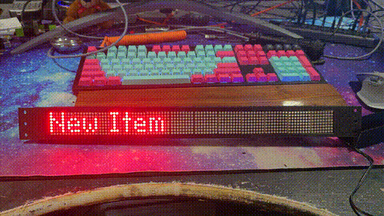
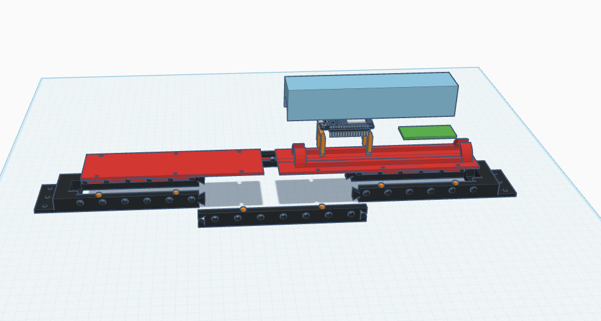

# ESP32 LED Matrix Controller

This project provides a versatile firmware and control interface for ESP32-based LED matrix displays. It supports scrolling text, static text, and decorative "twinkle" effects, all controllable through a RESTful API.





## Features

- **Multi-Item Playlist**: Display a sequence of different content (text, effects) with customizable durations
- **Multiple Display Modes**:
  - Text display with various alignments (left, center, right, scrolling)
  - Twinkle effect with adjustable density and speed
- **Smart Configuration**:
  - Save and persist settings across reboots
  - WiFi connection management
  - API key security
- **Flexible Control**:
  - RESTful API for remote control
  - Command-line interface for easy management
- **Special Features**:
  - One-time notifications that auto-delete after display
  - Configurable brightness, scroll speed, and timing
  - Web interface for basic status

## Hardware Requirements

- ESP32 development board
- MAX7219 LED matrix modules (supports up to 12 modules in a chain)
- 5V power supply (current depends on the number of LED modules)

## Getting Started

### Installation

1. Flash the firmware to your ESP32 using PlatformIO or Arduino IDE
2. Power on the device - it will create a WiFi access point named "WatkinsLabsLEDRackBAR"
3. Connect to this access point and navigate to 192.168.4.1 to configure your WiFi
4. After connecting to your network, the device will display its IP address

### Default Configuration

- Default API key: "WatkinsLabsLEDRack2025"
- Default hostname: "ledmatrix"
- Default access point: "WatkinsLabsLEDRackBAR"

## Command Line Interface

The project includes a Python CLI for easy control and management. Here's how to use it:

```bash
# Install dependencies
pip install requests

# Check if the device is online
python led_matrix_client.py --host ledmatrix.local status

# Get current settings
python led_matrix_client.py --host ledmatrix.local get

# Display a message
python led_matrix_client.py --host ledmatrix.local update --mode text --text "Hello World!" --alignment scroll_left
```

### Key CLI Commands

```
status              - Check device status
get                 - Get all settings
get-items           - Get all display items in the playlist
update              - Update current item display settings
add-item            - Add a new item to the playlist
delete-item         - Delete an item from the playlist
multi-items-demo    - Set up multiple display items for testing
temp-item-demo      - Add a temporary one-time display item
update-wifi         - Update WiFi credentials
update-hostname     - Update device hostname
reboot              - Reboot the device
```

### Creating a Multi-Item Playlist

```bash
# Set up a simple playlist with 3 different items
python led_matrix_client.py --host ledmatrix.local multi-items-demo

# Add a new text item
python led_matrix_client.py --host ledmatrix.local add-item --mode text --text "Important Announcement" --alignment center --brightness 15 --duration 8000

# Add a temporary notification that deletes itself after display
python led_matrix_client.py --host ledmatrix.local add-item --mode text --text "ALERT: One-time notification" --alignment scroll_left --brightness 15 --duration 10000 --delete-after true --max-plays 1
```

## API Endpoints

The device provides a RESTful API for control:

- `/status` - Get device status (no auth required)
- `/settings` - Get/update all settings
- `/items` - Get/add/delete display items
- `/items/replace` - Replace all display items
- `/update_display` - Update display settings
- `/update_wifi` - Update WiFi credentials
- `/update_hostname` - Update device hostname
- `/reboot` - Reboot the device
- `/list_files` - List files on the device
- `/download_config` - Download config file
- `/download_security_config` - Download security config

All API calls except `/status` require an API key, which can be sent as:
- HTTP header: `X-API-Key: YourApiKey`
- Query parameter: `?api_key=YourApiKey`

## Reset & Recovery

If you need to reset the device:

- **Factory Reset**: Power cycle the device 3 times within 30 seconds
- **Manual Reset**: Use the CLI command `manual-reset` to reset only WiFi settings
- **API Reset**: Send a POST to `/factory_reset` or `/manual_factory_reset`

## CLI Reference

Here's a detailed reference for the Python command-line interface:

```
usage: led_matrix_client.py [-h] [--host HOST] [--api-key API_KEY]
                           {status,get,get-items,update,add-item,delete-item,replace-items,
                            update-wifi,update-hostname,reboot,demo,twinkle-demo,
                            multi-items-demo,temp-item-demo,change-key,factory-reset,
                            manual-reset,download-config,list-files} ...

Control an ESP32 LED Matrix over HTTP API

optional arguments:
  -h, --help            show this help message and exit
  --host HOST           Hostname or IP address of the LED matrix (default: ledmatrix.local)
  --api-key API_KEY     API key for authentication

Commands:
  {status,get,get-items,update,...}
                        Command to execute
    status              Check if the LED matrix is online
    get                 Get current settings
    get-items           Get all display items
    update              Update display settings
    add-item            Add a new display item
    delete-item         Delete a display item
    replace-items       Replace all display items with new ones
    update-wifi         Update WiFi credentials
    update-hostname     Update device hostname
    reboot              Reboot the device
    demo                Run a demonstration of different settings
    twinkle-demo        Run a demonstration of twinkle mode
    multi-items-demo    Set up multiple display items for testing
    temp-item-demo      Add a temporary one-time display item
    change-key          Change the API key
    factory-reset       Trigger a factory reset
    manual-reset        Trigger a manual factory reset (WiFi reset only)
    download-config     Download a config file from the device
    list-files          List all files on the device
```

## Troubleshooting

- **Display not showing anything**: Check power supply and connections
- **Cannot connect to WiFi**: Try the manual reset procedure
- **Memory errors**: If the display behaves erratically, try the `reboot` command
- **Can't find device on network**: Try using the IP address instead of hostname
- **Web interface not responding**: Ensure the device has a stable WiFi connection


## TODO

- CLI effects display items in the item array but only at curent index.
- Validate reboot reset
- AP web interface unification
- item managment via web build
- Test API methods..
- validate loop obeys delay and pause for each item
- add gif/img display (array of bits)
- convert twinkle from special method to a proper item type 
- add other effects
- look into SSL and security
- look into profiles... 
- look into a linux service to control the led rack